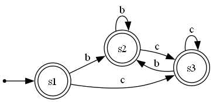
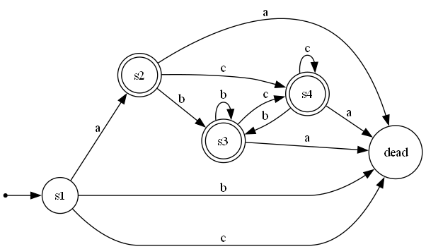

# Regular Expression to NFA and DFA Converter & Visualizer

This C++ program converts a regular expression into its equivalent Nondeterministic Finite Automaton (NFA) and further an equivalent Deterministic Finite Automation (DFA) using Thompson's construction. It also generates a DOT file to create a visual representation of the resulting NFA using Graphviz.

## Features

* **Postfix Conversion**: Converts standard regular expressions to postfix notation.
* **Thompson's Construction**: Builds an NFA from a postfix regular expression.
* **DFA Construction**: Builds an DFA from a generated NFA and also state reduction.
* **NFA and DFA Visualization**: Generates a `.dot` file for visualization in the dots folder and corresponding diagrams in diagrams folder.

## Prerequisites

1.  **A C++ Compiler**: Such as MinGW-w64 (Windows).
2.  **Graphviz**: Required to convert the `.dot` file into an image. Download from the [official Graphviz website](https://graphviz.org/download/) and ensure it is added to your system's PATH during installation.

## How to Use

### Step 1: Compile the Program
Navigate to the project directory and run the compilation command:

* **Windows (cmd)**:
    ```
    g++ automata.cpp -o automata.exe
    ```

### Step 2: Run the Executable
Execute the program from your terminal:

* **Windows (cmd)**:
    ```
    ./automata.exe
    ```

### Step 3: Enter a Regular Expression
When prompted, enter a regex using `.` for concatenation, `|` for union, `*` for the Kleene star, and `()` for grouping.

## Code Description

The regular expression is sent to helper function where first, it is converted to postfix form with a precedence defined among operators : '*', '?' > '.' > '|'. First, concatenation operator is put at appropriate places and then using standard stack technique, regex is converted to postfix form using toPostfix function in includes/regex_postfix.hpp  

The second step involves creating NFA using standard NFA diagrams for each of the operators by using the **Thomson's construction method**. Then createTransitionMap function in includes/helper.hpp is used to create transition map for each of the states and corresponding alphabets. 

This transition map is passed to create_dfa function in dfa.hpp where **subset-construction method** is used to create NFA. Further, DFA is minimized using state_reduction function in dfa.hpp using **Moore's algorithm** or **iterative refinement method**. Further, Automata class i.e. the parent of dfa and nfa also has a print method defined to print all transitions.

## Examples

### Example 1
**Input Regex**: `a|b`


### Example 2
**Input Regex**: `(b|c)*`




### Example 3
**Input Regex**: `a.(b|c)*`


