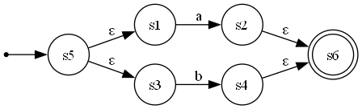
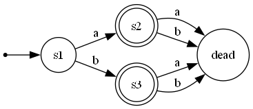
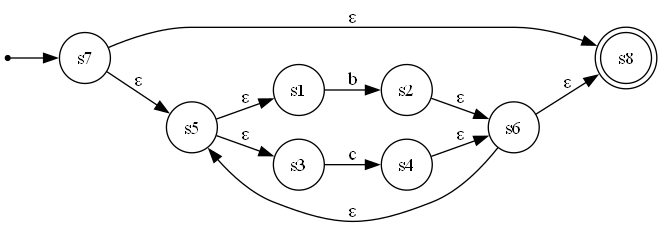
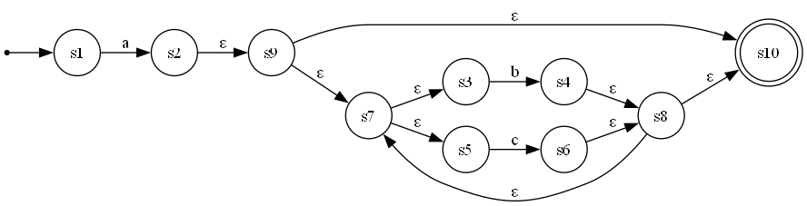

# Regular Expression to NFA and DFA Converter & Visualizer

This C++ program converts a regular expression into its equivalent Nondeterministic Finite Automaton (NFA) and further an equivalent Deterministic Finite Automation (DFA) using Thompson's construction. It also generates a DOT file to create a visual representation of the resulting NFA using Graphviz.

## Features

* **Postfix Conversion**: Converts standard regular expressions to postfix notation.
* **Thompson's Construction**: Builds an NFA from a postfix regular expression.
* **DFA Construction**: Builds an DFA from a generated NFA.
* **NFA and DFA Visualization**: Generates a `.dot` file for visualization in the dots folder and corresponding diagrams in diagrams folder.

## Prerequisites

1.  **A C++ Compiler**: Such as MinGW-w64 (Windows).
2.  **Graphviz**: Required to convert the `.dot` file into an image. Download from the [official Graphviz website](https://graphviz.org/download/) and ensure it is added to your system's PATH during installation.

## How to Use

### Step 1: Compile the Program
Navigate to the project directory and run the compilation command:

* **Windows (cmd)**:
    ```
    g++ automata.cpp -o automata.exe
    ```

### Step 2: Run the Executable
Execute the program from your terminal:

* **Windows (cmd)**:
    ```
    ./automata.exe
    ```

### Step 3: Enter a Regular Expression
When prompted, enter a regex using `.` for concatenation, `|` for union, `*` for the Kleene star, and `()` for grouping.

## Examples

### Example 1
**Input Regex**: `a|b`




### Example 2
**Input Regex**: `(b|c)*`




### Example 3
**Input Regex**: `a.(b|c)*`



